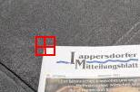

In this homework you are going to use the Harris corner detector to detect the
corners of a document. Document detection is a crucial task for many
applications, e.g., text recognition, automatic passport reading (at airport
gates), etc.

You will also have to design your own feature descriptor in order to localize
and distinguish among the 4 document corners.

At the end of this notebook, there are a couple of questions for you to answer.

So let's begin, shall we?


```{python}
import cv2
import numpy as np
from matplotlib import pyplot as plt
plt.rcParams['figure.figsize'] = [15, 10]
```

Let's load the image we will be working on in this homework.

```{python}
# Let's read the image
img = cv2.imread('./data/document.jpg')
# Convert it to gray scale
gray = cv2.cvtColor(img, cv2.COLOR_RGB2GRAY)
gray = np.float32(gray)/255
rows, cols = gray.shape

# Let's plot the images (colour and gray scale)
plt.subplot(121), plt.imshow(img)
plt.subplot(122), plt.imshow(gray, cmap='gray')
```

### Harris Corner Detector

Let us now compute Harris corners. Remember that the Harris detector computes
the "cornerness" score for each image pixel.

```{python}
# Compute Harris corners (use the available OpenCV functions)
# Suggested parameters:
#            block size of 2 pixels
#            gradient kernel size of 3 pixels
#            k parameter equal to 0.04
cornerness = cv2.cornerHarris(gray.astype(np.float32), blockSize=2, ksize=3, k=0.04)

# We are not interested in edges, so put to zero all negative cornerness values
cornerness = cornerness.clip(min=0)

# Since cornerness has a huge dynamic range, let's take the logarithm for better visualization and manipulation
cornerness = np.log(cornerness + 1e-6)
```

```{python}
# Let's now plot the image and the corresponding Harris corners (in log scale)
plt.subplot(121), plt.imshow(img)
plt.subplot(122), plt.imshow(cornerness)
```

At this point, you can see that the Harris detector has detected a lot of
features. Not only the four document corners, but also the corners
corresponding to (black) letters printed on (white) paper. How can we filter
out everything but the 4 document corners?

For that purpose, let's design a custom feature descriptor suitable to detect
the document corners. In order to do so, let's have a look at the top left
corner.



A good descriptor of that corner, given a certain neghbouring region, would be
to assess that the bottom-right quadrant is (much) brighter than the other
three quadrants (i.e. top-left, top-right, bottom-left). Let's then implement
it :-) I'll do the implementation for the top-left corner, you shall do the
rest.

```{python}
# Detection thresholds
th_top_left, th_top_right = -1e6, -1e6
th_bottom_left, th_bottom_right = -1e6, -1e6

# Corner coordinates
opt_top_left, opt_top_right = None, None
opt_bottom_left, opt_bottom_ritgh = None, None

# Size of each quadrant (in pixels)
quad_size = 7

# Let's now scan the Harris detection results
for r in range(quad_size, rows-quad_size):
    for c in range(quad_size, cols-quad_size):
        # Edges with too small cornerness score are discarded, -7 seems like a good value
        if cornerness[r, c] < -7:
            continue
        
        # Extract block consisting of 4 quadrants
        block = 255*gray[r-quad_size:r+quad_size+1, c-quad_size:c+quad_size+1]
        
        # Extract the four quandrants
        quad_top_left = block[0:quad_size, 0:quad_size]
        quad_top_right = block[quad_size:quad_size*2, 0:quad_size]
        quad_bottom_left = block[0:quad_size, quad_size:quad_size*2]
        quad_bottom_right = block[quad_size:quad_size*2, quad_size:quad_size*2]
        
        # Top-left corner
        # For the top-left document corner, the bottom-right quadrant is mostly paper and the rest is
        # darker background. Therefore, I suggest the descriptor to be the average difference between
        # the paper quandrant and the sum of the 3 remaining background quandrants
        descriptor = np.mean(quad_bottom_right) - \
                     np.mean(quad_top_left) - np.mean(quad_top_right) - np.mean(quad_bottom_left)
        # Let's detect the best descriptor
        if descriptor > th_top_left:
            # We update the threshold
            th_top_left = descriptor
            # And we update the optimal location
            opt_top_left = (c, r)
            
        # Top-right corner
        # (your implementation goes here)
        descriptor = np.mean(quad_bottom_left) - \
                     np.mean(quad_top_left) - np.mean(quad_top_right) - np.mean(quad_bottom_right)
        # Let's detect the best descriptor
        if descriptor > th_top_right:
            # We update the threshold
            th_top_right = descriptor
            # And we update the optimal location
            opt_top_right = (c, r)
            
        # Bottom-left corner
        # (your implementation goes here)
        descriptor = np.mean(quad_top_right) - \
                     np.mean(quad_top_left) - np.mean(quad_bottom_left) - np.mean(quad_bottom_right)
        # Let's detect the best descriptor
        if descriptor > th_bottom_left:
            # We update the threshold
            th_bottom_left = descriptor
            # And we update the optimal location
            opt_bottom_left = (c, r)
            
        # Bottom-right corner
        # (your implementation goes here)
        descriptor = np.mean(quad_top_left) - \
                     np.mean(quad_top_right) - np.mean(quad_bottom_left) - np.mean(quad_bottom_right)
        # Let's detect the best descriptor
        if descriptor > th_bottom_right:
            # We update the threshold
            th_bottom_right= descriptor
            # And we update the optimal location
            opt_bottom_right = (c, r)

# Let's draw circles at the detected corners
out = cv2.circle(img, opt_top_left, 3, (255,0,0), -1)
out = cv2.circle(img, opt_top_right, 3, (255,0,0), -1)
out = cv2.circle(img, opt_bottom_left, 3, (255,0,0), -1)
out = cv2.circle(img, opt_bottom_right, 3, (255,0,0), -1)

# And finally we plot the images (with the detected document corners)
plt.subplot(121), plt.imshow(out)
plt.subplot(122), plt.imshow(cornerness)
```

### Questions
* Does it matter whether the picture has been taken by a 1Mpx camera or a 12Mpx
  camera? How?

Yes. Higher camera resolution makes the features on the image occupy more
pixels. So the corner that might occupy a `7x7px` (`quad_size` value) box on a
low-resolution image may take up a lot more space on higher resolution picture.
If for low-resolution pic the feature lookup radius (`blockSize`) of `2px` may
be enough, that wouldn't if the feature takes up `sqrt(12)` times more space,
and the detector will treat super local features (details) as global ones.

* If we increased the resolution of the camera, what would you change in the
  current algorithm?

For higher resolution pictures, the coefficients of corner detection algorithm
must be then adapted to operate with larger block size and gradient kernel
values. I would increase `blockSize` and `quad_size` values to reflect the
camera resolution scale (~3.5 times). I'll need to increase Sobel kernel size
`ksize` so it's large enough to compute gradients at the scale of features we
are interested in.

The correctness threshold (`-7` was proposed) and `k` sensitivity parameter
should not require changes as camera resolution changes as those are only used
in gradient computation (`k` in `R = det(M) - k * trace(M)^2`) and Harris
corner detection results filtering (the threshold, that discards all correction
values below `e^(-7)`).

### SIFT demo (extra task) 

SIFT is a powerful feature detector invariant to scale. 

```{python}
img = cv2.imread('./data/house-1.jpg')
img = cv2.cvtColor(img, cv2.COLOR_BGR2RGB)

gray = cv2.cvtColor(img, cv2.COLOR_RGB2GRAY)
sift = cv2.SIFT_create(contrastThreshold=0.1)
kp = sift.detect(gray, None)
img = cv2.drawKeypoints(img, kp, img, flags=cv2.DRAW_MATCHES_FLAGS_DRAW_RICH_KEYPOINTS)

plt.imshow(img)
```

```{python}
img = cv2.imread('./data/house-1.jpg')
img = cv2.cvtColor(img, cv2.COLOR_BGR2RGB)

gray = cv2.cvtColor(img, cv2.COLOR_RGB2GRAY)
sift = cv2.SIFT_create(contrastThreshold=0.1)
kp = sift.detect(gray, None)
img = cv2.drawKeypoints(img, kp, img, flags=cv2.DRAW_MATCHES_FLAGS_DRAW_RICH_KEYPOINTS)

plt.subplot(121), plt.imshow(img)

img = cv2.imread('./data/house-2.jpg')
img = cv2.cvtColor(img, cv2.COLOR_BGR2RGB)

gray = cv2.cvtColor(img, cv2.COLOR_RGB2GRAY)
sift = cv2.SIFT_create(contrastThreshold=0.1)
kp = sift.detect(gray, None)
img = cv2.drawKeypoints(img, kp, img, flags=cv2.DRAW_MATCHES_FLAGS_DRAW_RICH_KEYPOINTS)

plt.subplot(122), plt.imshow(img)
```

The keypoint set seems to be consistent across the images. I tried to restrict
number of strongest keypoints with `nfeatures` param of `cv2.SIFT_create()`,
but with the value below 3000 most of the points are on the tree branches, so
left the call signature as is :)

By setting `contrastThreshold` to 0.1 (default is 0.04) I did manage to reduce
the "noisy" keypoints on the roof.

Intesestinly, resizing the image to 30% of the original did result in more
accurate keypoint selection

```{python}
img = cv2.imread('./data/house-1.jpg')
img = cv2.cvtColor(img, cv2.COLOR_BGR2RGB)
img = cv2.resize(img, (0, 0), fx=0.3, fy=0.3)

gray = cv2.cvtColor(img, cv2.COLOR_RGB2GRAY)
sift = cv2.SIFT_create(contrastThreshold=0.1)
kp = sift.detect(gray, None)
img = cv2.drawKeypoints(img, kp, img, flags=cv2.DRAW_MATCHES_FLAGS_DRAW_RICH_KEYPOINTS)

plt.subplot(121), plt.imshow(img)

img = cv2.imread('./data/house-2.jpg')
img = cv2.cvtColor(img, cv2.COLOR_BGR2RGB)
img = cv2.resize(img, (0, 0), fx=0.3, fy=0.3)

gray = cv2.cvtColor(img, cv2.COLOR_RGB2GRAY)
sift = cv2.SIFT_create(contrastThreshold=0.1)
kp = sift.detect(gray, None)
img = cv2.drawKeypoints(img, kp, img, flags=cv2.DRAW_MATCHES_FLAGS_DRAW_RICH_KEYPOINTS)

plt.subplot(122), plt.imshow(img)
```
